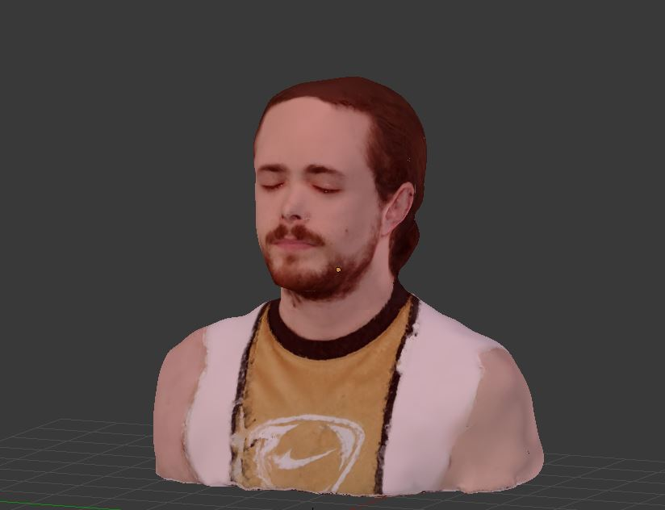

# Photogrammetry_MII

## Computer Engineering Master 19-20

Photogrammetry activity done for the subject "Virtual environments" in the Computer Engineering Master. In this activity we had to digitalize any object by photogrammetry, so i decided to digitalize myself. For this purpose I used [Meshroom](https://alicevision.org/#meshroom) to generate the object model and [blender](https://www.blender.org/) to adjust and modify that model. The model was created with 300 photographs of myself from diferent angles. The object file and the final blender model can be found on the next links: [Object](./src/Me.obj), [Final model](Final.blend).

